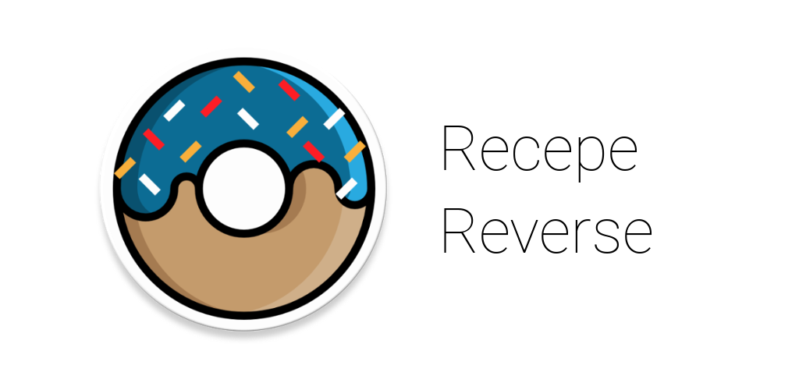
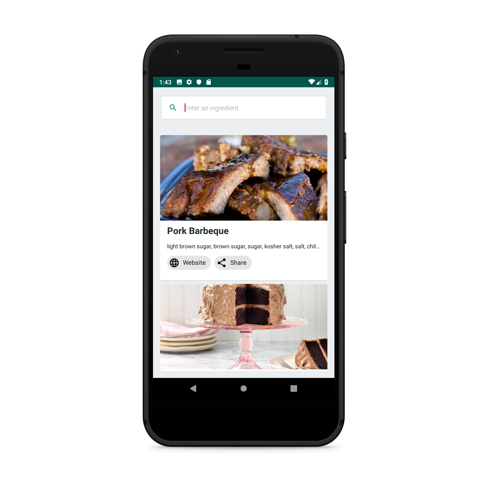

# Recipe Reverse



Recipe Reverse allows you to find a popular recipe by specifying the ingredients you have.

### Get it on Google Play

<a href="https://play.google.com/store/apps/details?id=com.cognition.android.recipereverse"></a>

#

An Android app that uses AndroidX Artifacts and Material Components to demonstrate the use of ```AutoCompleteTextView``` and ```Chips```. It uses Firebase Cloud Firestore and Firebase Cloud Storage.

 &nbsp;
 &nbsp;
 &nbsp;
 &nbsp;